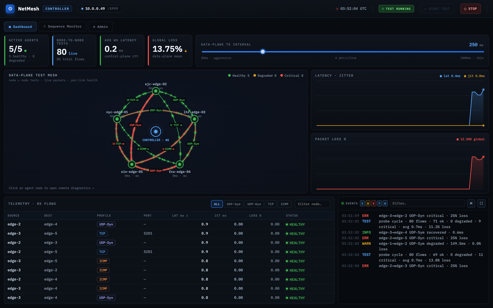
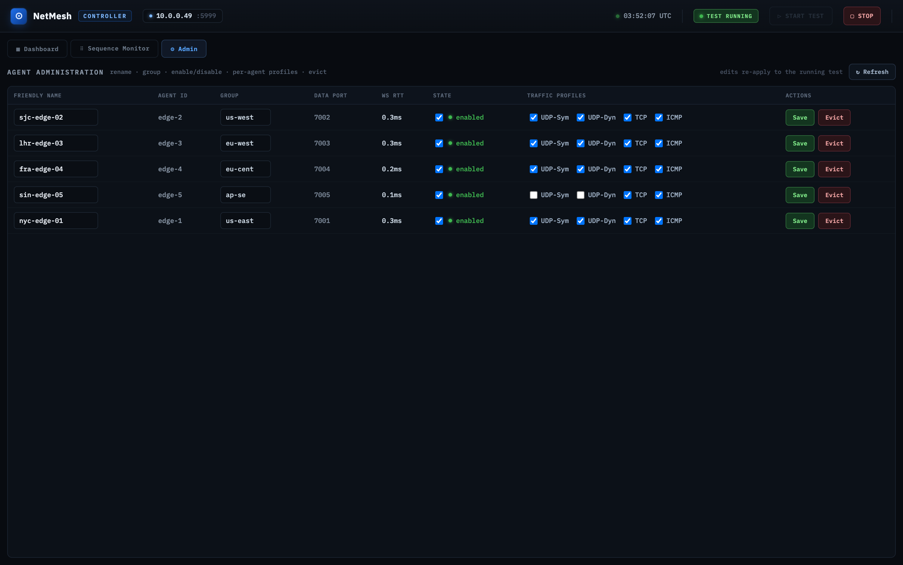
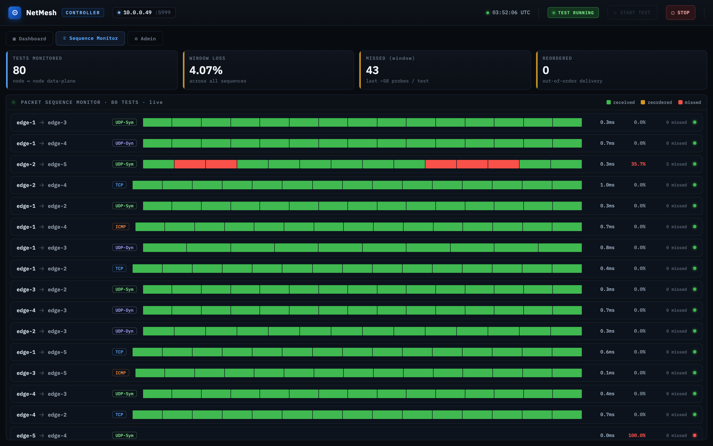
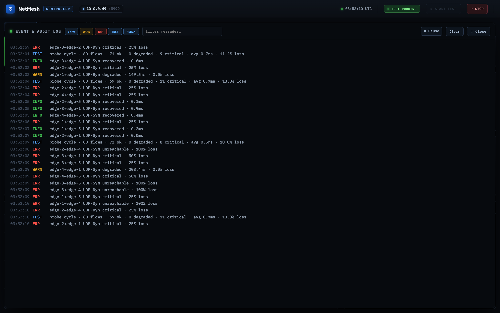

# NetMesh

A distributed network connectivity testing tool. A single Go binary (`netmesh`)
runs as either the **Controller (Master)** or an **Agent (Node)**, forming a
mesh of up to ~25 nodes that validates routing and measures latency / packet
loss across multiple traffic profiles during critical network change windows.

> **Status:** Foundation + resilient control plane + the full operator UI
> (ported from the `NetMesh.dc.html` design) + the data-plane engine and
> Responder are implemented and wired to live data. All four traffic profiles
> measure real round-trip time and packet loss; the only caveat is UDP-symmetric
> on a single loopback host (see [Data plane](#data-plane)). See
> [Implementation status](#implementation-status).

## Screenshots

| Controller dashboard | Agent administration |
|---|---|
| [](docs/img/dashboard.png) | [](docs/img/admin.png) |

| Sequence monitor | Event log (maximized) |
|---|---|
| [](docs/img/sequence-monitor.png) | [](docs/img/event-log.png) |

The **Controller dashboard** shows the live data-plane test mesh (topology with
travelling packets), KPI strip, latency/jitter and packet-loss charts, the
telemetry grid, and the live event log. The **Admin** page manages the fleet
(rename, group, enable/disable, per-agent traffic profiles, evict). The **event
log** can be maximized, filtered by level and text, and paused/resumed with a
"jump to latest" catch-up. There is also a per-node [Agent view](docs/img/agent.png).

## Quick start

**Build from source** (Go 1.26+):

```bash
git clone https://github.com/jbhoorasingh/netmesh.git
cd netmesh
go build -o netmesh ./cmd/netmesh
```

Or grab a pre-built binary for your platform from the
[Releases](https://github.com/jbhoorasingh/netmesh/releases) page.

**Run:**

```bash
# Controller (open — everyone has full access)
./netmesh -master=self -port=5999

# Controller (secured — anonymous read-only, writes require login)
./netmesh -master=self -admin=admin:secret -port=5999

# Agent that joins a known controller immediately
./netmesh -master=10.10.10.5 -port=5999

# Agent in holding state — the local UI prompts for a Master IP
./netmesh -port=5999
```

Open `http://<host>:5999/` for the UI on either role, then press **START TEST**
on the Controller. To try the whole mesh on one machine, give each agent a
distinct data port — see [Data plane](#data-plane).

## CLI

| Flag      | Meaning                                                                 |
|-----------|-------------------------------------------------------------------------|
| `-master=self`    | Run as Controller.                                              |
| `-master=<IP>`    | Run as Agent and join that Controller (`host` or `host:port`). |
| _(omitted)_       | Run as Agent in **holding** state; join later via the UI / `POST /api/join`. |
| `-admin=user:pass`| Secure the Controller (enables RBAC). Controller-only.         |
| `-port=<port>`    | UI/API/WebSocket port on both roles. Default **5999**.         |
| `-id=<name>`      | Override the advertised agent ID (defaults to hostname).       |
| `-token=<secret>` | Optional shared secret for the agent control plane: required of joining agents on the Controller, presented when joining on an Agent. Empty = open control plane. |
| `-data-port=<port>` | Agent data-plane UDP/TCP echo port for peer probes. Default `-port + 1`. Give each agent a distinct value when running several on one host. |

## Architecture

```
cmd/netmesh/main.go        Entry point; parses CLI and dispatches by mode.
internal/
  config/                  CLI parsing -> validated Config + Mode.
  logging/                 Structured JSON events (slog) + in-process EventBus.
  protocol/                Wire contract: Envelope, sequence numbers, telemetry,
                           routing tables, diag requests.  (transport-agnostic)
  spooler/                 Bounded ring buffer: last 1000 metrics, flushed on
                           reconnect.
  transport/
    pump.go                Peer: shared Read/Write Pump + app-layer ping/pong.
    client.go              Agent client: exponential-backoff reconnect, register,
                           spool flush, telemetry batching.
    hub.go                 Controller hub: agent registry, per-agent sequence
                           tracking (PACKET_SEQUENCE_MISSED), broadcast/send.
  dataplane/               Probe engine + per-profile probers (TCP real;
                           UDP src-port binding; ICMP pending raw socket).
  diag/                    Whitelisted diagnostics executor (no shell).
  auth/                    RBAC: open vs. secured; Basic Auth, constant-time.
  controller/              Controller runtime: HTTP/WS server, REST API, UI
                           fan-out, telemetry store.
  agent/                   Agent runtime: client + engine + diag + local UI.
web/                       Embedded UI assets (placeholder until design sync).
```

### Resilient control plane

- **Read/Write Pump** (`gorilla/websocket`): exactly one reader and one writer
  per connection; all other goroutines enqueue frames through a channel.
- **Application-layer heartbeat:** each side emits a JSON `PING` every **10 s**;
  the read deadline is **15 s**, refreshed on every frame. A silently dropped
  (half-open) TCP session trips the deadline and forces a reconnect.
- **Exponential backoff:** 1 s → 2 s → … capped at **30 s**, with ±20 % jitter
  to avoid a thundering herd. Backoff resets after a connection stays up ≥ 30 s.
- **Telemetry spooler:** while disconnected, metrics accumulate in a 1000-entry
  ring buffer (oldest dropped, counted as overflow). On reconnect the agent
  registers, then replays the spool in FIFO order marked `replay` so the
  Controller reconciles rather than double-counts.
- **Sequence tracking:** every metric carries a per-agent monotonic `seq`. The
  Controller tracks the watermark per agent and emits `PACKET_SEQUENCE_MISSED`
  on a live gap. Each control frame also carries a per-connection `seq`.

### RBAC

| Mode                 | Anonymous                          | Authenticated |
|----------------------|------------------------------------|---------------|
| Open (no `-admin`)   | Full access                        | n/a           |
| Secured (`-admin`)   | Read-only (topology/grid/graphs)   | Full access   |

Read routes (`/api/agents`, `/api/metrics`, `/api/auth`, `/ws/ui`) are always
open; privileged routes (`/api/tests/*`, `/api/routing`, `/api/diag`) are gated
by `auth.RequireWrite`. Credentials are compared in constant time.

### Diagnostics console (security boundary)

Controller-initiated, executed on the Agent. **No shell is ever invoked**
(`exec.Command`, not `sh -c`). Only these commands run, with package-owned
flags:

| Command      | Executed as            |
|--------------|------------------------|
| `ping`       | `ping -c 4 <host>`     |
| `traceroute` | `traceroute -m 20 -w 2 <host>` |
| `nslookup`   | `nslookup <host>`      |
| `netstat`    | `netstat -an`          |

The single user-supplied value (a target host) is validated against a strict
hostname/IP pattern and may not begin with `-` (argument-injection guard).
Output is streamed back over the control plane in bounded chunks.

## Data plane

On `TEST_START`, each agent runs one goroutine per (peer, profile) and probes on
the configured cadence, submitting sequence-numbered metrics. Every agent also
runs a **Responder** — UDP and TCP echo servers on its data-plane port
(advertised at registration) — so probes complete a real round trip:

| Profile | How it measures | Notes |
|---------|-----------------|-------|
| **TCP** | connect + payload echo round trip | RTT incl. connect |
| **UDP dynamic** | burst of datagrams from an ephemeral source port → echo | loss = lost/burst |
| **UDP symmetric** | same, but the source port is bound **equal to the destination port** (`SO_REUSEPORT`) | tests strict/symmetric firewall pinholes; see caveat |
| **ICMP** | echo requests via an unprivileged datagram socket (`udp4`) | OS answers; no responder needed |

Each probe sends a small burst (4 packets) and reports average RTT and loss %.

> **UDP-symmetric single-host caveat:** "source port == destination port" makes
> the source and destination endpoints identical when every agent shares one
> loopback IP (`127.0.0.1`), which is degenerate. The binding is correct for the
> real case (one agent per host / distinct IPs); on a single dev host symmetric
> shows partial success while the other three profiles are fully healthy.

To exercise the mesh on one machine, give each agent a distinct data port:

```bash
./netmesh -master=self -port=5999                                  # controller
./netmesh -master=127.0.0.1:5999 -port=6001 -data-port=7001 -id=a  # agents
./netmesh -master=127.0.0.1:5999 -port=6002 -data-port=7002 -id=b
# open http://127.0.0.1:5999 and press START TEST
```

## Web UI

The single binary embeds and serves the operator UI (`web/index.html` +
`web/app.js`) — a faithful vanilla port of the `NetMesh.dc.html` Claude Design
prototype, driven entirely by the live API. A host renders the **Controller** or
**Agent** view based on its own role (reported by `/api/info`); there is no demo
role toggle.

- **Controller:** KPI strip, data-plane test-mesh topology (canvas), live
  latency/jitter and packet-loss charts, sortable/filterable telemetry grid, a
  live event log (maximizable, filter by level + text, pause/resume the tail with
  a "N new — jump to latest" catch-up), a Sequence Monitor with per-flow
  packet-sequence strips, node/test drill-down drawers, the Remote Diagnostics
  terminal, and an **Admin** page for agent management.
- **Agent:** node identity, master + WebSocket link health, local KPIs, local
  latency chart, local flows, and the holding-state "Join a Master" modal.

The dashboard is live, not simulated: control-plane RTT comes from the
application-layer heartbeat, and node-to-node flows come from the data-plane
engine (TCP connect probes succeed today; UDP/ICMP show as pending/loss until
the responder lands).

### HTTP / WS surface

| Route | Access | Purpose |
|-------|--------|---------|
| `GET /` , `/app.js`      | open       | embedded UI assets |
| `GET /api/info`          | open       | role, host, port, auth state, diag commands |
| `GET /api/auth`          | open       | auth state; returns a `wsToken` to authenticated callers |
| `GET /api/agents`        | open       | connected agents + per-agent WS RTT / frames |
| `GET /api/metrics`       | open       | latest metric per (agent, peer, profile) |
| `GET /ws/ui`             | open\*     | live event / telemetry / diag stream |
| `POST /api/tests/start`  | privileged | start a test (auto-builds a full mesh if no body) |
| `POST /api/tests/stop`   | privileged | stop the active test |
| `POST /api/routing`      | privileged | push an explicit routing table |
| `POST /api/diag`         | privileged | run a whitelisted diagnostic on an agent |
| `POST /api/admin/agents` | privileged | update an agent's label/group/enabled/profiles |
| `POST /api/admin/agents/evict` | privileged | force-drop an agent's control link |
| `GET /ws/agent`          | token\*\*  | agent control plane |
| `POST /api/join` (agent) | loopback   | set the Master IP at runtime |

\* `/ws/ui` enforces a same-origin check (anti-CSWSH); on a secured controller
diagnostic **output** is delivered only to authenticated sessions (via the
`wsToken`). \*\* `/ws/agent` requires the `-token` secret when one is set.

## Admin / agent management

The Controller's **Admin** tab (privileged — requires login when `-admin` is set)
manages the fleet:

- **Friendly name** — a label shown on the topology and node detail instead of
  the raw agent ID.
- **Group** — a free-form tag (region, role).
- **Enable / disable** — disabled agents are excluded from the mesh (neither
  probe nor are probed) and told to stop.
- **Per-agent traffic profiles** — choose which of UDP-Sym / UDP-Dyn / TCP / ICMP
  each agent generates; `START TEST` builds each agent its own routing table
  accordingly, and edits **re-apply live** to a running test.
- **Evict** — force-drop an agent's control link.

Config is persisted best-effort to `netmesh-admin.json` (controller working
directory) so names and test config survive a restart. The data plane honours it
end-to-end: e.g. an agent set to TCP+ICMP only generates exactly those flows, and
a disabled agent disappears from the mesh entirely.

## Security hardening

The control plane was reviewed adversarially; notable properties:

- **Agent `/api/join` is loopback-only** — a LAN peer cannot repoint an agent's
  Master.
- **`/ws/agent` optional join token** (`-token`) — constant-time, gates agent
  registration/impersonation.
- **`/ws/ui` same-origin check** — prevents cross-site WebSocket hijacking of the
  live stream; diagnostic output is restricted to authenticated sessions.
- **Bounded everything** — websocket read limit, REST `MaxBytesReader`, server
  `ReadTimeout`/`IdleTimeout`, capped diagnostic runtime/output.
- **In-order spool flush** — replayed metrics are enqueued ahead of live traffic
  on reconnect, and gap detection tolerates reordering/duplicates, so no spurious
  `PACKET_SEQUENCE_MISSED`.

## Telemetry & events

All system state transitions are emitted as structured JSON (`slog`) and pushed
to the UI: `CONTROLLER_STARTED`, `AGENT_JOINED`, `AGENT_REGISTERED`,
`AGENT_DROPPED`, `WS_CONNECTED/DISCONNECTED/RECONNECTING`, `TEST_STARTED`,
`TEST_STOPPED`, `ROUTING_UPDATED`, `PACKET_SEQUENCE_MISSED`,
`TELEMETRY_SPOOLED/FLUSHED`, `DIAG_REQUESTED/COMPLETED/REJECTED`,
`AUTH_REJECTED`.

While a test runs the Controller also emits live, telemetry-derived events so the
audit log reflects ongoing activity: `MESH_SUMMARY` (a probe-cycle summary every
3s) and `FLOW_CRITICAL` / `FLOW_DEGRADED` / `FLOW_RECOVERED` on per-flow health
transitions (throttled to one per flow per 10s). The UI's START/STOP controls
reflect live test state (`/api/info` `testRunning` + the `TEST_STARTED/STOPPED`
events): START is disabled while a test runs, STOP while idle.

## Testing

```bash
go test -race ./...
```

Covers the spooler ring buffer (FIFO, overflow, concurrency), CLI parsing
(modes + validation), the diagnostics whitelist (injection hardening), the
protocol envelope round-trip, per-agent sequence-gap detection, the admin
config store, and the data-plane responder echo path.

## Building & CI

The binary is pure Go (`CGO_ENABLED=0`) and cross-compiles cleanly. GitHub
Actions:

- **CI** (`.github/workflows/ci.yml`) — on every push/PR: `go vet`, `gofmt`
  check, `go test -race`, and `go build`, uploading a linux/amd64 binary
  artifact.
- **Release** (`.github/workflows/release.yml`) — on a `v*` tag (or manual
  dispatch): cross-compiles `linux/amd64`, `linux/arm64`, `darwin/amd64`,
  `darwin/arm64`, and `windows/amd64`, and attaches the binaries to a GitHub
  Release.

Cut a release:

```bash
git tag v0.1.0 && git push origin v0.1.0
```

Build for another platform locally:

```bash
GOOS=linux GOARCH=arm64 CGO_ENABLED=0 go build -o netmesh_linux_arm64 ./cmd/netmesh
```

(The data-plane `SO_REUSEPORT` socket option is selected per-OS via build tags —
`reuseport_unix.go` / `reuseport_windows.go` — so Windows builds compile too.)

## Cloud / Claude Code dev environment

The repo ships a Dev Container (`.devcontainer/devcontainer.json`) that
provisions the Go 1.26 toolchain, the [Claude Code](https://code.claude.com)
CLI, and forwards the NetMesh UI ports. One definition serves three workflows:

**GoLand (JetBrains).** Develop inside the container:

1. Open the project → **Start Dev Container inside IDE** (or connect via
   [JetBrains Gateway](https://www.jetbrains.com/help/go/connect-to-devcontainer.html));
   GoLand runs its backend in the container.
2. Install the **Claude Code [Beta]** plugin from the JetBrains Marketplace. It
   invokes the `claude` CLI that the container already has on `PATH` (launch with
   `Ctrl+Esc`). If needed, point it at the binary under
   *Settings → Tools → Claude Code → Claude command*.

**GitHub Codespaces.** *Code → Create codespace on main* — the container builds
with Go + Claude Code ready. Add a Codespaces secret named
`CLAUDE_CODE_OAUTH_TOKEN` (generate it on a trusted machine with
`claude setup-token`) or `ANTHROPIC_API_KEY`; it auto-injects as an env var so
`claude` works headless.

**Claude Code on the web.** At [claude.ai/code](https://claude.ai/code), connect
this GitHub repo and start a session — Anthropic's sandbox uses the same Dev
Container. Auth and the GitHub token are managed by the platform.

**Authentication summary**

| Where | How |
|-------|-----|
| Local / GoLand (interactive) | Run `claude` once, complete the browser login (uses your Claude subscription — no API key). |
| Codespaces / headless | Store `CLAUDE_CODE_OAUTH_TOKEN` (`claude setup-token`) or `ANTHROPIC_API_KEY` as a secret/env var. |
| Claude Code on the web | Managed by the platform. |

The container login persists across rebuilds via the `netmesh-claude-config`
volume mounted at `~/.claude`. Shared project permissions (allowing `go build` /
`go test` / etc. without prompts) live in the tracked `.claude/settings.json`.

> **Running the mesh inside the container:** TCP and UDP profiles work as-is.
> The ICMP profile uses unprivileged datagram sockets gated by
> `net.ipv4.ping_group_range`; to make ICMP probes succeed in-container on a
> Docker host, add `"runArgs": ["--sysctl=net.ipv4.ping_group_range=0 2147483647"]`
> to the Dev Container (see the comment in `.devcontainer/devcontainer.json`).
> Codespaces may reject custom sysctls; ICMP otherwise reports "unavailable"
> while the other profiles keep working.

## Implementation status

| Area | State |
|------|-------|
| Single-binary modes, CLI, graceful shutdown | ✅ implemented |
| Resilient WS control plane (pump, backoff, heartbeat) | ✅ implemented |
| Telemetry spooler + sequence tracking | ✅ implemented |
| RBAC (open / secured) | ✅ implemented |
| Diagnostics whitelist + streaming | ✅ implemented |
| Structured JSON event logging + UI fan-out | ✅ implemented |
| Data plane: TCP payload round-trip probe | ✅ implemented |
| Data plane: UDP dynamic (echo RTT + loss) | ✅ implemented |
| Data plane: UDP symmetric (src-port binding + echo) | ✅ implemented; ⚠️ degenerate on single loopback host |
| Data plane: ICMP (unprivileged datagram echo) | ✅ implemented |
| Data-plane **Responder** (peer UDP/TCP echo) | ✅ implemented |
| Production UI (topology / grid / graphs / console / sequence monitor) | ✅ implemented from `NetMesh.dc.html`, wired to live data |
| Admin page (rename / group / enable-disable / per-agent profiles / evict) | ✅ implemented, persisted, honored by the test engine |
| Optional control-plane join token (`-token`) | ✅ implemented |

## Design provenance

The UI was implemented from the `NetMesh.dc.html` Claude Design prototype
(delivered as a handoff bundle). The prototype is a React/canvas mock with
simulated data; it was recreated pixel-faithfully as a dependency-free vanilla
`web/app.js` and rewired to the live backend. The prototype's demo-only role
toggle was intentionally dropped — a real host runs in one fixed role set by its
backend.
